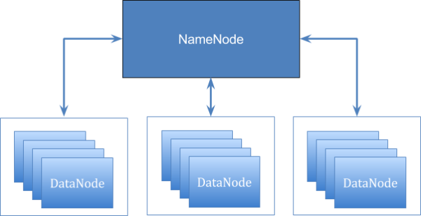

# Hadoop HDFS

[HDFS](<https://hadoop.apache.org/docs/current/hadoop-project-dist/hadoop-hdfs/HdfsDesign.html>) stands for Hadoop Distributed File System. 

It is a highly available, distributed file system for storing very large amounts of data, which is organized in clusters of servers. The data is stored on several computers (nodes) within a cluster, which is done by dividing the files into data blocks of fixed length and distributing them redundantly across the nodes.

## Cluster

**Nodes:**

- master - **NameNode** - is responsible for processing all incoming requests and organizes the storage of files and the associated metadata in the the slave nodes.

- slave - **DataNodes** - store data

## Characteristics

- **Fault-tolerant**: Each file is split into blocks of a configurable size (64MB or 128MB). These blocks are replicated across different machines based on a replication factor assuring that if a machine gets down, the data contained in its blocks can be served from another machine.

- **Write Once Read Many principle**: Data is transferred as a continuous stream when an HDFS client asks for it. It implies that HDFS does not wait to read the entire file and sends the data as soon as it reads it making the data processing efficient. On the other hand, HDFS is immutable: no update/modification can be performed on a file hosted in HDFS.

- **Scalable**: There are no limitation in number of machine regarding the storage capacity. Also, notice that HDFS is made for big files. Having a lot of small files consumes idle RAM space on master nodes and may decrease the performance of HDFS operations.

- **Highly Available**: HDFS is built with an automated mechanism to detect and recover from faults. Its distributed structure makes it a resilient product.

## Interaction with cluster

To access to the cluster:

-> your computer
-> VPN to Cluster
-> Edge node - first machine via SSH

Linux and HDFS commands:

`hdfs dfs -help`

- `fs` : `hdfs dfs -ls`
- `cd` : x
- `cp` : 
- `mv`

Examples:

`hdfs dfs -put <src_on_Edge> <dest_on_HDFS>`

- absolute path (`/tmp/data`) 
- relative path in HDFS (`/user/your_user/`)
