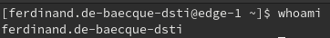
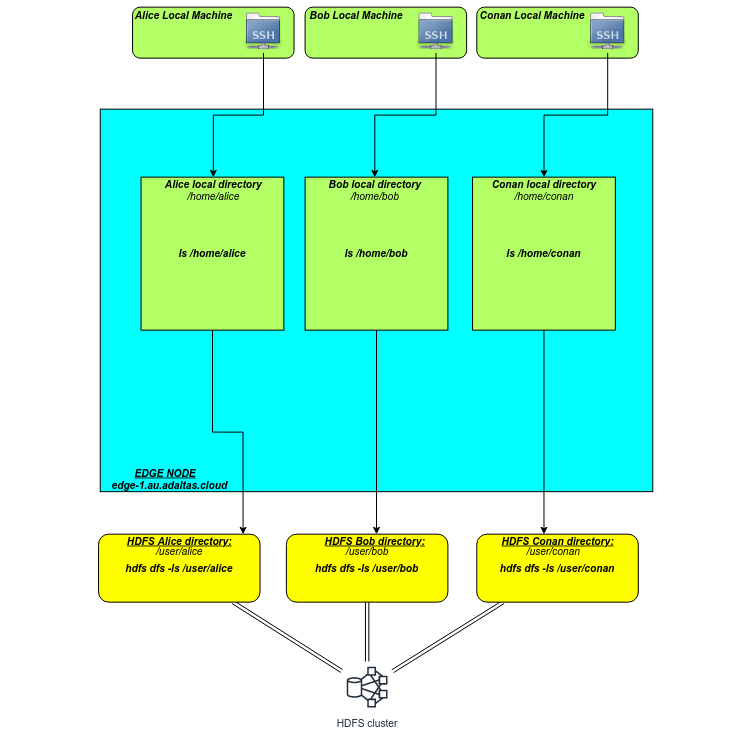
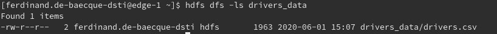
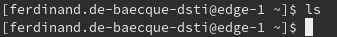

# Lab

## Objectives

A prerequisite to execute the following is to be connected to the `edge-1` node via SSH.



In this tutorial you will:

1. Discover the **HDFS basic commands**
2. Create a file on the "edge node" and move it to HDFS
3. Pipe a downloaded book file with `curl` directly into HDFS

## HDFS, your local machine and edge node

- Nothing is stored on the local machine.
- You connect from your local machine to the "edge node" using SSH.
- When a file needs to be retrieved from the web and stored on HDFS:
  - Download the file on the "edge node".
  - Write it to HDFS.
- If you download heavy files, always pipe them directly into HDFS and never attempt to write it temporarily on the edge node. If you are not familiar with Unix pipe, an example is shown below.



## HDFS basic commands

The list of all the available options can be retrieved by typing `hdfs dfs -help` on the edge node. 
You can also refer to [this documentation](<https://hadoop.apache.org/docs/stable/hadoop-project-dist/hadoop-common/FileSystemShell.html>).

The following commands are used very often:

- `hdfs dfs -mkdir <XxX>` - create a directory in HDFS at the user local root folder
- `hdfs dfs -put <src> <dst> ` - upload object(s) to HDFS
- `hdfs dfs -cp <src> <dst>` - copy a file
- `hdfs dfs -mv <src> <dst>`- move a file (also used to rename a file)
- `hdfs dfs -rm <object>` - delete an file (use `-r` to delete a folder)

## 1. Manage files on HDFS

In this example we will create a file on the "edge node" and move it to HDFS.

Let's create a `drivers.csv` file. To do that, copy and run the following block on the "edge node":

```bash
cat <<EOF > drivers.csv
10,George Vetticaden,621011971,244-4532 Nulla Rd.,N,miles
11,Jamie Engesser,262112338,366-4125 Ac Street,N,miles
12,Paul Coddin,198041975,Ap #622-957 Risus. Street,Y,hours
13,Joe Niemiec,139907145,2071 Hendrerit. Ave,Y,hours
14,Adis Cesir,820812209,Ap #810-1228 In St.,Y,hours
15,Rohit Bakshi,239005227,648-5681 Dui- Rd.,Y,hours
EOF
```

This file is stored on your user folder on the "edge node", you can print it with the command:

```bash
cat drivers.csv
```

Now, let's create an HDFS subfolder, run sequentially:

```bash
# Creates a directory named "drivers_data"
hdfs dfs -mkdir drivers_data

# Upload the file into the subfolder
hdfs dfs -put drivers.csv drivers_data
```

You now can list the files in the created directory by the command:

```bash
hdfs dfs -ls drivers_data
```

It will output something similar as this:



The file is now stored in HDFS, we don't need to keep the original one in our local folder on the "edge node". To delete it run:

```bash
rm ./drivers_csv
```

So, you can check that it was deleted by listing the files:



## 2. Pipe a file into HDFS

In this example we will pipe a downloaded book file with `curl` directly into HDFS.

```bash
# TODO : find the good link and the good file name.
curl -sS https://www.google.com/robots.txt | hdfs dfs -put - /robots.txt
```
