# Hadoop YARN

- "Yet Another Resource Negotiator" 
- The brain of Hadoop Ecosystem

## Architecture

Conceptually, a **master** node is the communication point for a **client** program. A **master** sends the work to the rest of the cluster, which consists of **worker** nodes. 

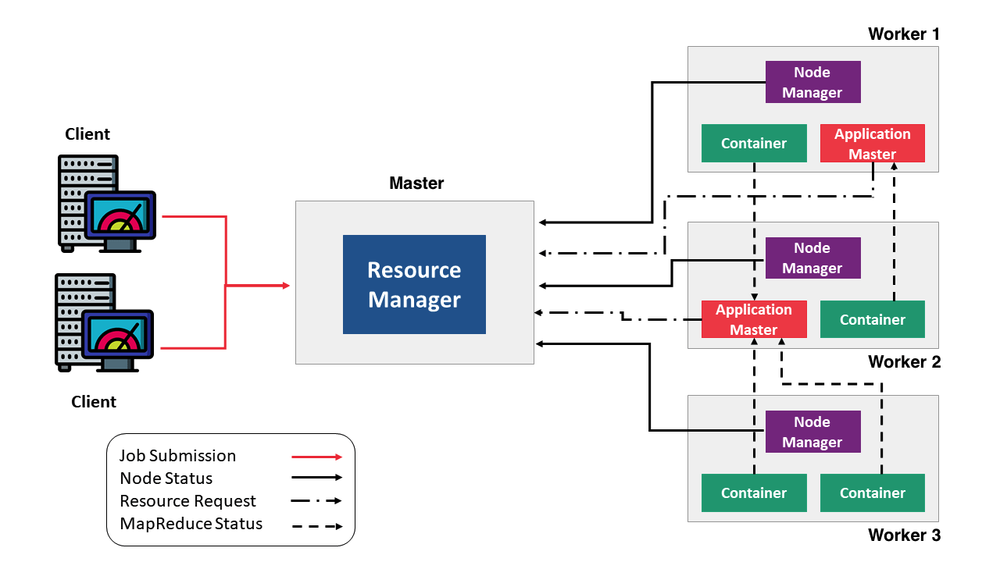

**YARN components:**

- **Client:**   
It submits [MapReduce](https://hadoop.apache.org/docs/current/hadoop-mapreduce-client/hadoop-mapreduce-client-core/MapReduceTutorial.html) jobs.

- **ResourceManager:**   
It is the master daemon of YARN and is responsible for resource assignment and management among all the applications. Whenever it receives a processing request, it forwards it to the corresponding **NodeManager** and allocates resources for the completion of the request accordingly. It has two major components:
  - **Scheduler:**   
  It performs scheduling based on the resource requirements of the allocated applications and available resources. It is a pure scheduler, means it does not perform other tasks such as monitoring or tracking of status for the application. Also, it offers no guarantees about restarting failed tasks either due to application failure or hardware failures.   
  The Scheduler has a pluggable policy which is responsible for partitioning the cluster resources among the various queues, applications etc. The current schedulers such as the [CapacityScheduler](https://hadoop.apache.org/docs/current/hadoop-yarn/hadoop-yarn-site/CapacityScheduler.html) and the [FairScheduler](https://hadoop.apache.org/docs/current/hadoop-yarn/hadoop-yarn-site/FairScheduler.html) would be some examples of plugins.
  - **ApplicationsManager:**   
  It is responsible for accepting the application and negotiating the first container from the **ResourceManager**. It also restarts the **ApplicationMaster** container if a task fails.

- **NodeManager:**   
It take care of individual node on Hadoop cluster and manages application and workflow and that particular node. Its primary job is to keep-up with the **ResourceManager**. It monitors resource usage, performs log management and also kills a container based on directions from the **ResourceManager**. It is also responsible for creating the container process and start it on the request of Application master.   

- **ApplicationMaster:**   
The per-application **ApplicationMaster** has the responsibility of negotiating appropriate resource containers from the Scheduler, tracking their status and monitoring for progress.

- **Container:**   
It is a collection of physical resources such as RAM, CPU cores and disk on a single node. The containers are invoked by Container Launch Context (CLC) which is a record that contains information such as environment variabl

## How YARN works?

Application execution consists of the following steps:

- **Application submission**
- **Bootstrapping** the ApplicationMaster instance for the application
- **Application execution** managed by the ApplicationMaster instance

## Application submission in YARN

A YARN job or an application can be submitted to the cluster by the command `yarn jar` with options. On the image below there are the steps involved in application submission of Hadoop YARN:

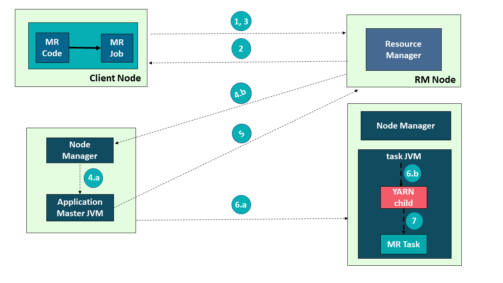

1. Submit the job

2. Get Application ID

3. Application submission context

4.   
  a) Start Container Launch   
  b) Launch Application Master

5. Allocate Resources

6.   
  a) Container   
  b) Launch

7. Execute

### Application execution in YARN

Let’s walk through an application execution sequence (steps are illustrated in the diagram):

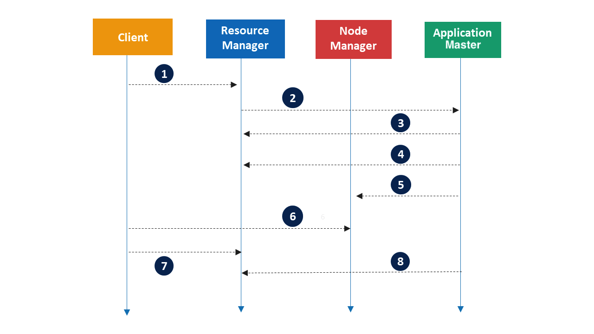

1. A **client** program submits the application, including the necessary specifications to launch the application-specific **ApplicationMaster** itself.
2. The **ResourceManager** assumes the responsibility to negotiate a specified **container** in which to start the **ApplicationMaster** and then launches the **ApplicationMaster**.
3. The **ApplicationMaster**, on boot-up, registers with the **ResourceManager** – the registration allows the client program to query the ResourceManager for details, which allow it to  directly communicate with its own ApplicationMaster.
4. During normal operation the **ApplicationMaster** negotiates appropriate resource **containers** via the resource-request protocol.
5. On successful container allocations, the **ApplicationMaster** launches the **container** by providing the container launch specification to the **NodeManager**. The launch specification, typically, includes the necessary information to allow the container to communicate with the **ApplicationMaster** itself.
6. The **application** code executing within the **container** then provides necessary information (progress, status etc.) to its **ApplicationMaster** via an application-specific protocol.
7. During the application execution, the **client** that submitted the program communicates directly with the **ApplicationMaster** to get status, progress updates etc. via an application-specific protocol.
8. Once the application is complete, and all necessary work has been finished, the **ApplicationMaster** deregisters with the **ResourceManager** and shuts down, allowing its own container to be repurposed.

## Monitoring with YARN ResourceManager UI

You can monitor the application submission ID, the user who submitted the application, the name of the application, the queue in which the application is submitted, the start time and finish time in the case of finished applications, and the final status of the application, using the ResourceManager UI.

To access the ResourceManager web UI in Adaltas Cloud refer to this link - http://yarn-rm-1.au.adaltas.cloud:8088/ui2. 

[[info | Notice]]
| The ResourceManager UI is Kerberos protected, and you need to pass the [Kerberos authentication](/en/docs/onboarding/kerberos/) to get in.

- **Monitoring applications**

You can search for applications on the **Applications** page. 

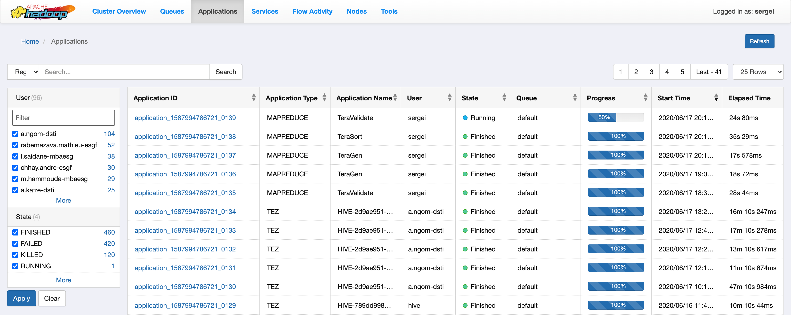

In the precedent example we submitted the TeraGen application with the ID `application_1587994786721_0137`. To view the details refer to its link.

In the **Application List** tab we can see all the attempts that were performed while executing this application:

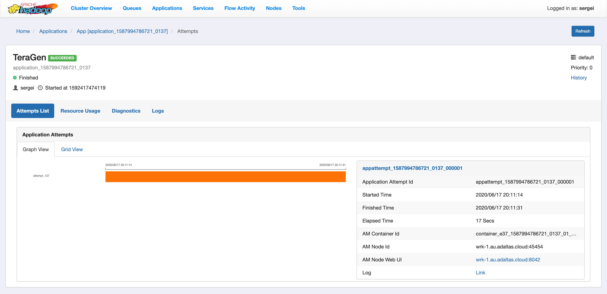

The detail information about each attempt is available on the **Attempt Info** page, where you can explore how many containers were launched and on what nodes:

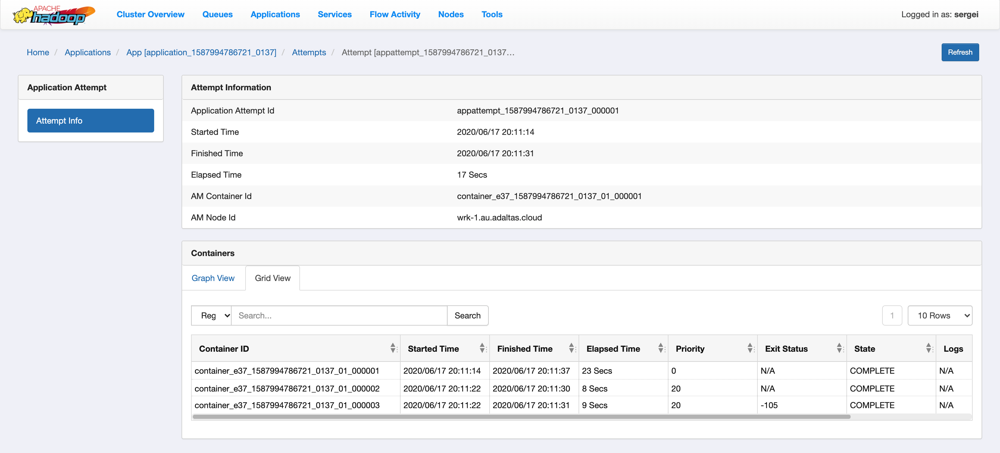

The log information can be extracted in the **Logs** tab. You can specify the log of what attempt and of what container you want to extract, either what type of log selecting the available filter fields:

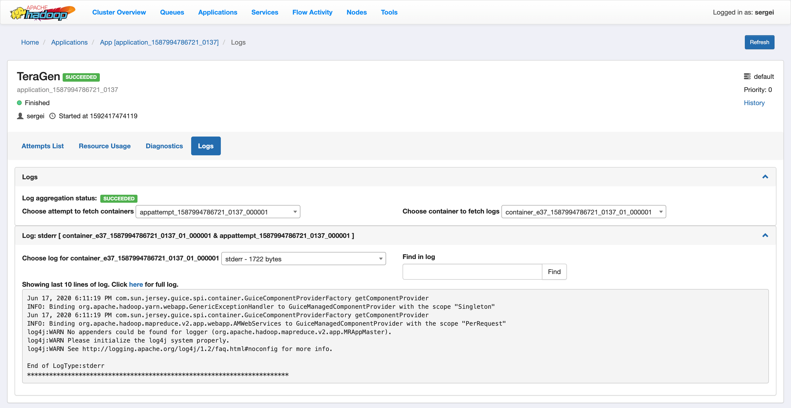

Also, in the tabs **Resource Usage** and **Diagnostic** you can observe information during application execution. Here is some screenshot examples:

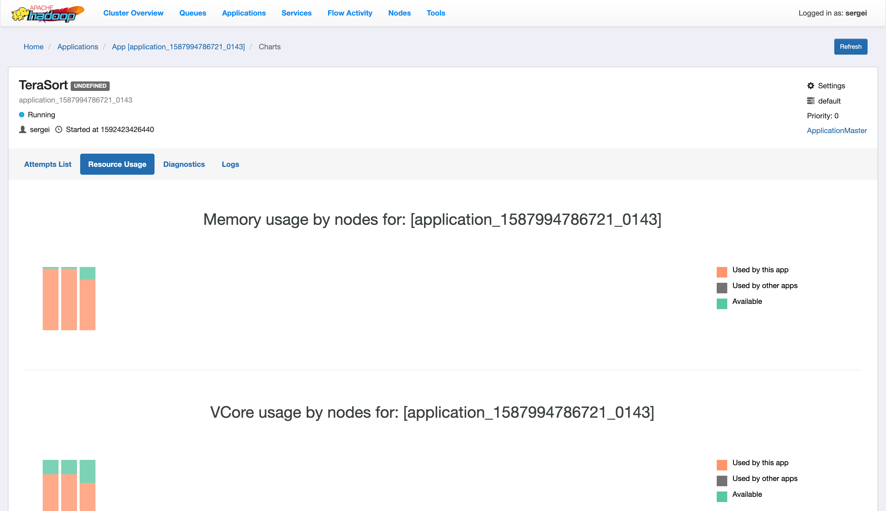

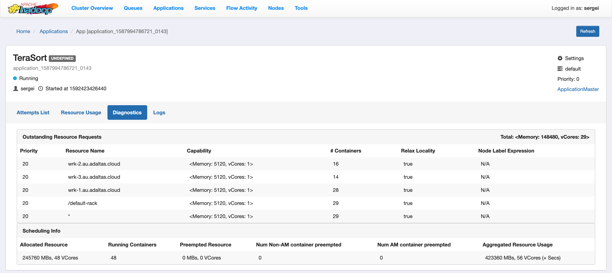 

- **Monitoring cluster**

The **Cluster Overview** page shows cluster resource usage by applications and queues, information about finished and running applications, and usage of memory and vCores in the cluster.

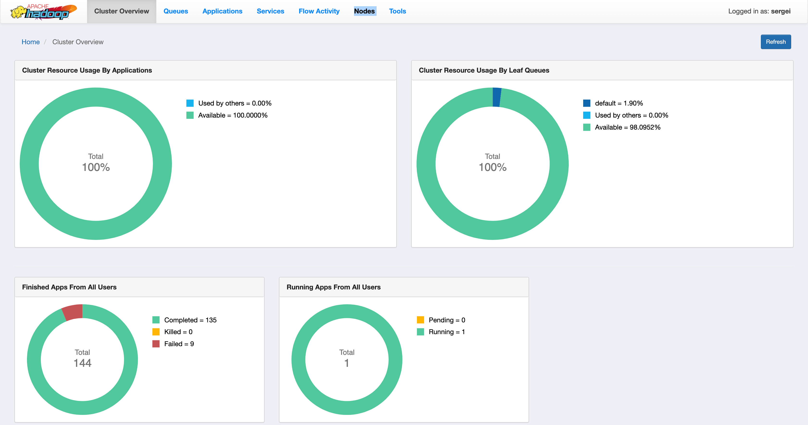

- **Monitoring nodes**

The **Nodes** page on the YARN Web User Interface enables you to view information about the cluster nodes on which the NodeManagers are running.

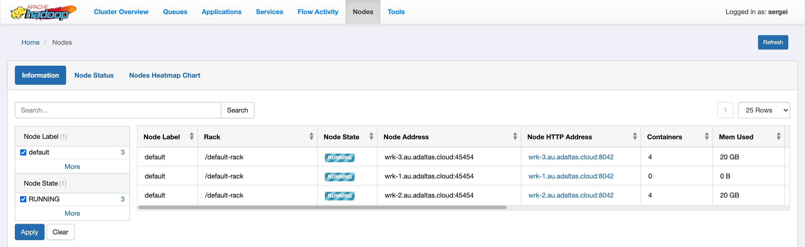

- **Monitoring queues**

The **Queues** page displays details of YARN queues. You can either view queues from all the partitions or filter to view queues of a partition.

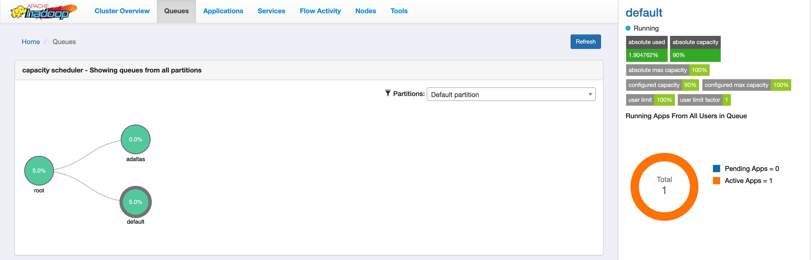

- **Monitoring flow activity**

You can view information about application flows from the **Flow Activities** page.

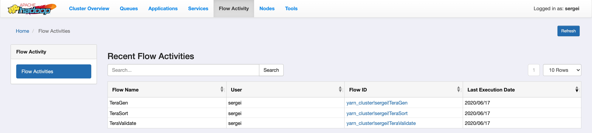

- **Tools**

You can view the YARN configuration and YARN Daemon logs on the **Tools** page.

