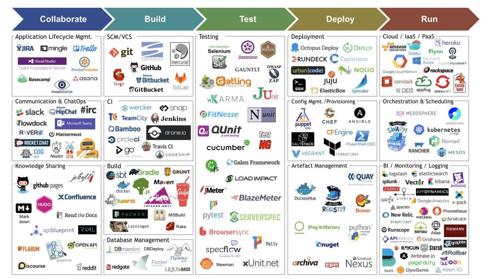
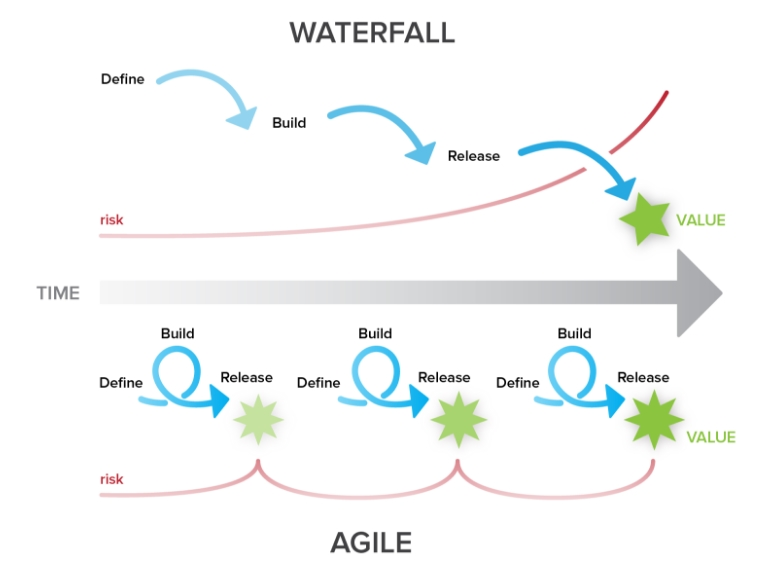
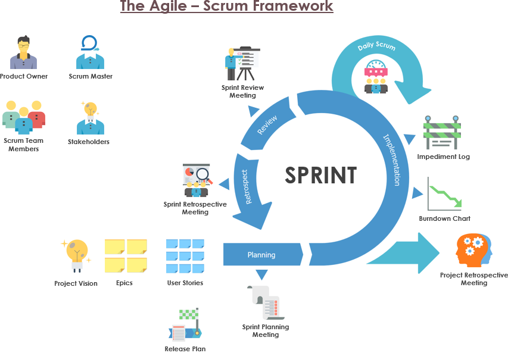

# Introduction to DevOps

## DevOps

- **DevOps** is a culture of human communication, technical processes and tools
- **DevOps** is breaking barriers between Developers and Operations by automating processes, in order to build, test, and release software faster and more reliably.

## Why DevOps?

- Faster Time To Market
- Recovery time is reduced
- Problems are easier to detect
- System is overall more stable
- (Most) Repetitive tasks are automated
- You have less and less time available as the workload increases. Automation is essential

## DevOps life cycle


## Site Reliability Engineering (SRE) implements DevOps

| DevOps                        | SRE                                                                                         |
| ----------------------------- | ------------------------------------------------------------------------------------------- |
| Reduce organization silos     | Using the same tools and techniques                                                         |
| Accept failure as normal      | Have a formula for balancing accidents and failures against new releases                    |
| Implement gradual change      | Encourage moving quickly by reducing costs of failure                                       |
| Leverage tooling & automation | Minimizing manual systems work to focus on efforts that bring long-term value to the system |
| Measure everything            | Measuring availability, uptime, outages, toil, etc.                                         |

## SRE

- **Service Level Indicators (SLI)**  
  Metrics over time (latency, throughput of requests per second, or failures per request)
- **Service Level Objectives (SLO)**  
  Targets for the cumulative success of SLIs over a period ("last 30 days" or "this quarter")
- **Service Level Agreement (SLA)**  
  Promise by a service provider to a service customer about availability. Usually less than SLO.

## Site Reliability Engineering (SRE) tools

**"Everything should be completely automated."**



## Back to the history

- Companies were focused on planning and documenting their software development cycles
- Agile Manifesto in 2001 - https://agilemanifesto.org/
- Agile principles were applied to software development
- In 2014, we started speaking about DevOps (in [Site Reliability Engineering](https://landing.google.com/sre/books/))

[Read more](https://www.atlassian.com/agile/manifesto)

## Agile vs Waterfall



## The Agile Manifesto

We are uncovering better ways of developing software by doing it and helping others do it. Through this work we have come to value:

- **Individuals and interactions** over processes and tools
- **Working software** over comprehensive documentation
- **Customer collaboration** over contract negotiation
- **Responding to change** over following a plan

That is, while there is value in the items on the right, we value the items on the left more.

[Source](https://agilemanifesto.org/)

## Agile Principles

- Customer satisfaction is top priority
- Project requirements can change
- Do frequent deliveries
- Business & Devs must collaborate throughout the project
- Project actors must be motivated
- Prefer face-to-face conversations
- A working software is the main measure of progress
- Project pace should be sustainable and be maintained
- Pay attention to technical aspects and design
- Keep it simple
- Teams should be self-organized
- Reflect on the progress and process used regularly

## Scrum

**Scrum is a framework:**

- Lightweight
- Simple to understand
- Difficult to master

**Used for:**

- developing
- delivering
- sustaining complex products

**Consists of:**

- Scrum Teams and their roles
- events
- artifacts
- rules

**Built on:**

- Transparency  
  Significant aspects of the process must be visible to those responsible for the outcome
- Inspection  
  Scrum users must frequently inspect Scrum artifacts and progress toward a Sprint Goal to detect undesirable variances
- Adaptation

## Scrum



## Version management with SemVer

Formula: `MAJOR.MINOR.PATCH-LABEL`

Examples:

```
2.3.1
1.0.0-alpha
1.0.0-beta
```

- `MAJOR` - version when you make incompatible API changes,
- `MINOR` - version when you add functionality in a backwards compatible manner,
- `PATCH` - version when you make backwards compatible bug fixes,
- `LABEL` - for pre-release and build metadata are available as extensions to the MAJOR.MINOR.PATCH format.

[Read more about SemVer](https://semver.org/)
