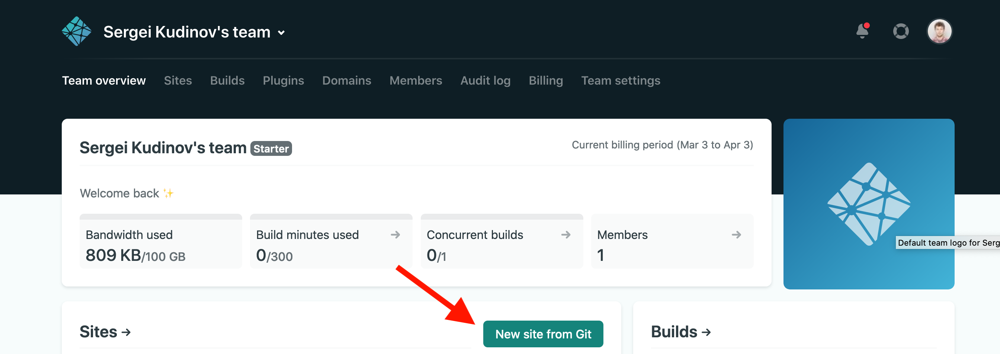
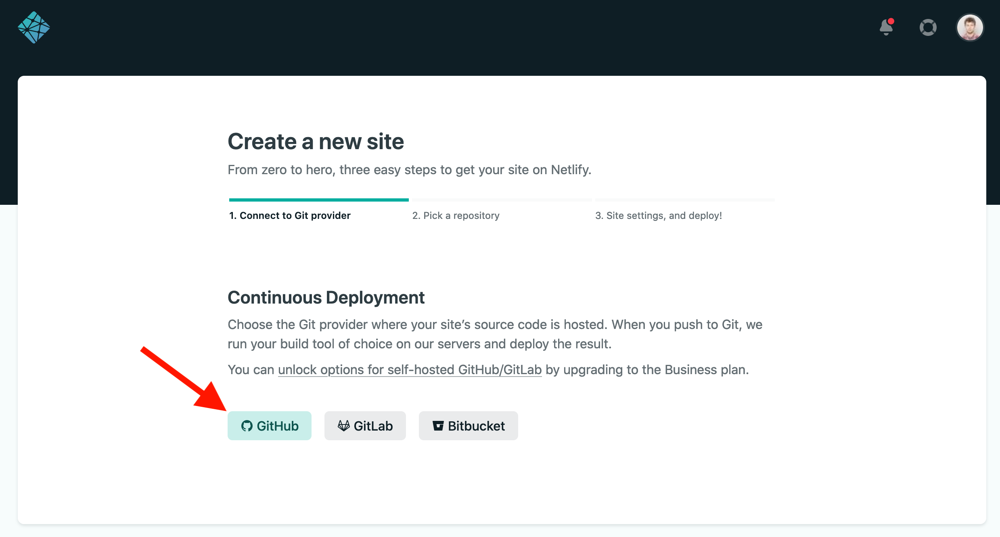
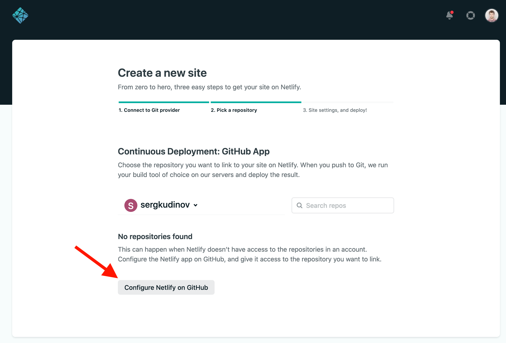
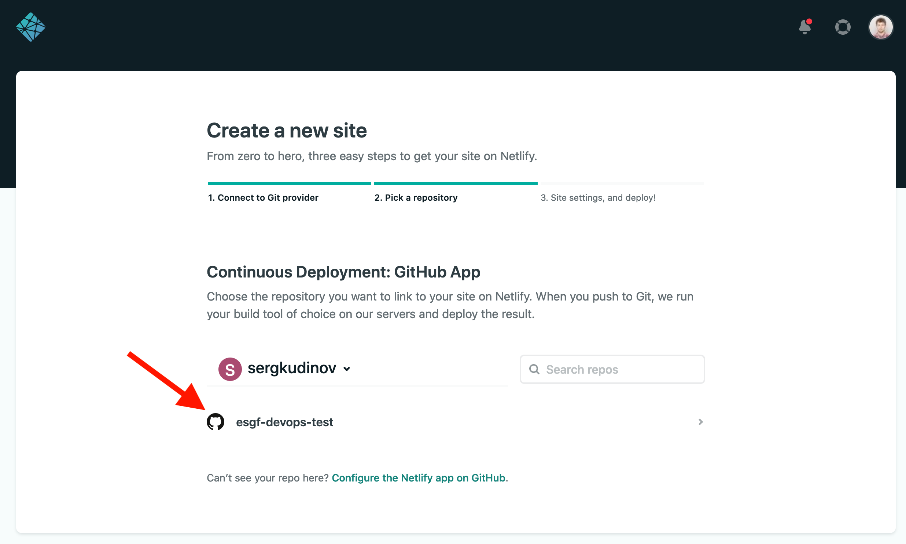
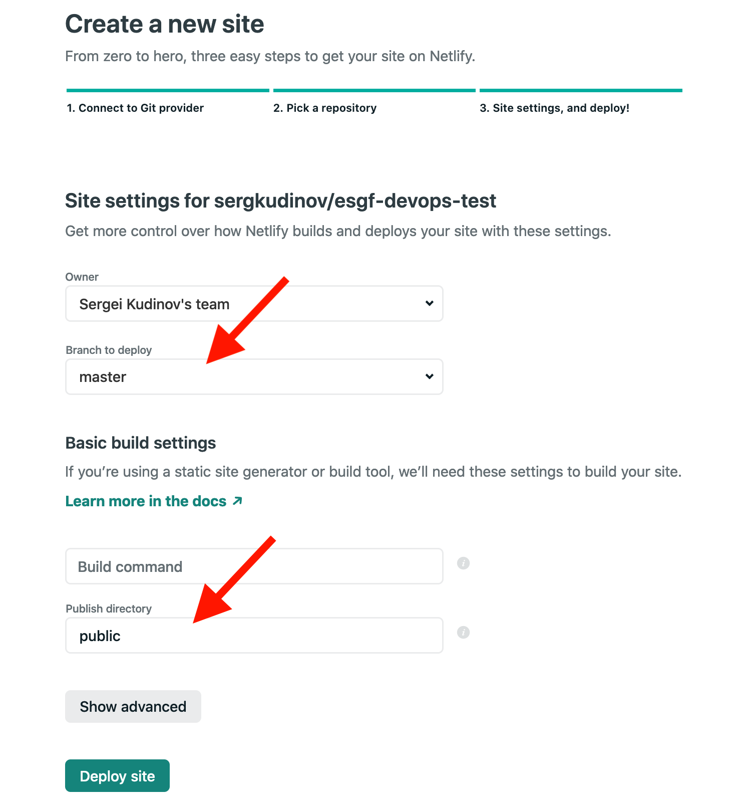
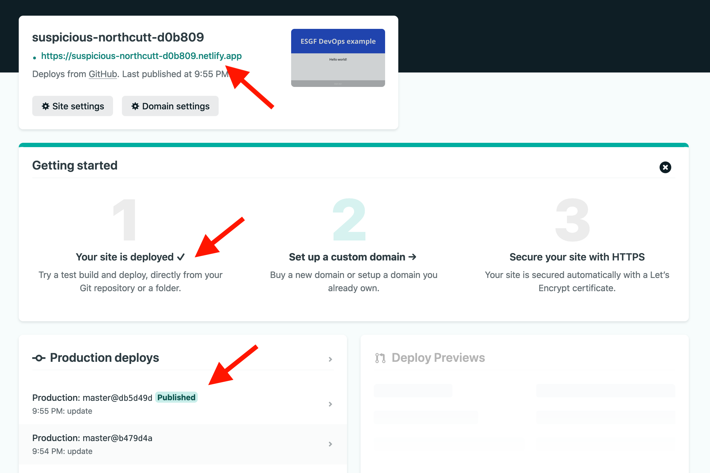
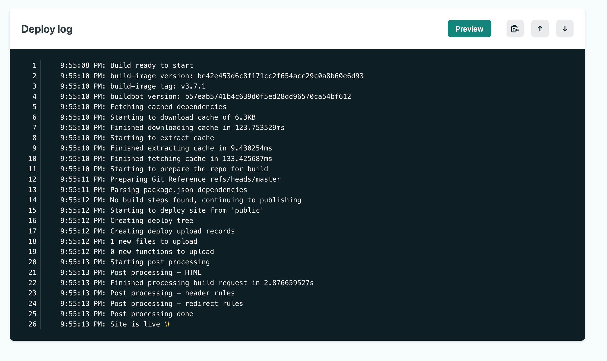

# Lab

The goal of this lab is to learn the proper way of creating an IT project from initializing a project folder to pushing it to a remote repository. The project is implementing a static website with configured Continuous Deployment pipeline using Netlify. 

## Objectives

1. Start a project
2. Create a static website
3. Document the project
4. Push the project to GitHub
5. Implement Continuous Deployment to Netlify

## Prerequisites

1. Knowledge of basic Git commands, Git installed and an existing [GitHub](https://github.com/) account.
2. Knowledge of basic CLI Bash commands.

> Note for Windows users only! Don't use the default *CMD.exe*, because it has different commands from the command line of Linux OS, which is used in most IT environments. Instead, use **Git Bash** (should be installed when installing Git) or **PowerShell**. 

## 1. Start a project

**Note!** When creating any folders or files, don't use spaces (` `). Otherwise, you will have to use escaping characters when navigating to them. It is recommended to use the "kebab-case" naming convention by separating words with dashes (`-`).

1. Using **CLI Bash commands** in your terminal (Terminal or Git Bash) navigate to the directory where you will store your project folder.

[Learn basic CLI bash commands](https://www.educative.io/blog/bash-shell-command-cheat-sheet)

Example:

```bash 
cd ~/path/to/your-root-project-directory
```

2. Choose a name for your project (for example, `my-devops-project`) and create a directory:

```bash
mkdir my-devops-project
```

Then navigate to this directory:

```bash
cd my-devops-project
```

3. Initialize a [Git repository](https://git-scm.com/book/en/v2/Git-Basics-Getting-a-Git-Repository)

```bash
git init
```

A project has started. Let's create a website.

## 2. Create a static website

1. Inside the project folder, create a subfolder `public`. Here we will keep all the static files that the website will use.

2. Create the file `index.html` containing [HTML](https://developer.mozilla.org/en-US/docs/Web/HTML) and [CSS](https://developer.mozilla.org/en-US/docs/Web/CSS) code. You can use the content of a provided example [here](assets/index.html). Then, open this file in a browser to verify the layout.

3. Commit modifications:

```bash
git add .
git commit -m "create website"
```

Your simple website is ready. Let's document the project with a README.md file.

## 3. Document the project

1. Create the `README.md` file under the root folder (`my-devops-project`). The file uses the [Markdown syntax](https://www.markdownguide.org/basic-syntax/) which is widely used in IT projects documentation. Developers love it for the clarity and simplicity!

You can refer to [this documentation](https://www.makeareadme.com/) to learn more about README files.

2. Put some content inside the file using Markdown, for example:

```md
# My DevOps project

This is an example project implementing a static website.

## Usage

Open the static HTML file [index.html](public/index.html) in a browser.

## Project structure

- [`public`](public) - contains static files

## Author

Firstname LASTNAME    
email@example.com
```

3. Commit modifications:

```bash
git add .
git commit -m "add readme"
```

The minimal documentation is written. Let's now push the project to a remote repository on GitHub.

## 4. Push the project to GitHub

1. Login to [Github.com](https://github.com/)

2. Navigate to the **"Your repositories"** page

3. Click on **"New"**   
  - Choose a name, like *"my-devops-project"*
  - Chose the **"Public"** option
  - Click on **"Create repository"**

4. Link local and remote repositories:

```bash
git remote add origin YOUR_REPOSITORY_URL
```

5. Add an upstream branch and push commits:

```bash
git push --set-upstream origin master
```

## 5. Implement Continuous Deployment to Netlify

[Netlify](https://www.netlify.com/) is a cloud-based service allowing instantly build and deploy websites from Git. It is free for personal projects, hobby sites, or experiments.

1. Create an account on Netlify.   
  - Click on **"Sign up"** button
  - Sign up with GitHub account

2. Create a deployment following the steps.

- Click on "New site from Git":



- Set up Continuouse Deployment with GitHub:



- Click on "Configure Netlify on GitHub" and complete the process choosing appropriate options:



- Once GitHub is configured, choose you repository:



- Configure deployment settings. Choose the branch to deploy, the directory containing the static files (`public`) and click on "Deploy site":



- If configured correctly, your website is deployed in a few seconds. Click on the generated link to access your website:



- If you click on an item under the "Production deploys" section you will a deploy log. In case of any errors during deployment, you can figure it out and fix the problem:



Now your website is deployed. Moreover, it will be redeployed on every push to the master branch of the GitHub repository. Let's test it

3. Modify the "Hello world!" message in you `index.html` file, commit and push it to GitHub. In a few seconds this will appear on your Netlify deployment.

## Bonus tasks

1. Find a setting on Netlify to change the generated Netlify subdomain (`.netlify.app`).

2. Place an image on the webpage using the [``](https://developer.mozilla.org/en-US/docs/Web/HTML/Element/img) HTML tag and push it to GitHub.
